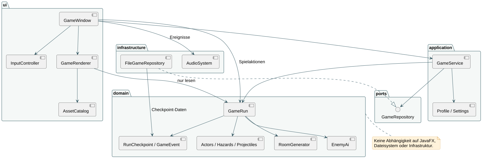

# ABYSS · Vom Heck bis zur Brücke

Ein Pixel-Art-Roguelite in Java/JavaFX: Du beginnst im Heck eines riesigen U-Boots und kämpfst dich durch vier Sektionen und 24 Räume bis zur Brücke nach vorn – und danach immer tiefer, gegen Schwärme aus bis zu 1600 gleichzeitigen Gegnern. Mit Laufstegen, Kombos, Ausweichen, acht aktiven Modulen, stapelbaren Modulen und Entfesselungen, Levelaufstiegen, fünf Taucherklassen, vier Sektorwächtern, der Prismenkaiserin und einer dauerhaften Laufbahn.

**Version 1.4 vom 03.10.2026 (Entfesselt-Update: Endgame, baut auf Laufbahn 1.3 und Schwarm-Update 1.2 auf).** Weiterentwicklung des Prototyps 0.2 (22.09.2026) mit Claude Code (Modell Claude Opus 5.5). Das Spiel wird weiter ausgebaut. Code, Grafiken, Klänge und Dokumentation sind KI-gestützt entstanden; Details in `docs/KI_EINSATZ.md`. Menschliche Spieltests, Teamreview und fachliche Abnahme stehen noch aus.

## Sofort spielen

Aus dem Quellcode: `./gradlew run` (JDK 25) oder auf dem Mac `run.command` doppelklicken. Eine eigenständige Mac-App (Java enthalten, Apple Silicon) baut `python3 tools/package_mac.py` nach `dist/Abyss.app`; das fertige Paket ist nicht im Repository.

Erster Versuch: **Neuer Tauchgang → Die Mechanikerin → Tauchen.** Der erste Raum zeigt die Steuerung.

## Steuerung

| Aktion | Taste |
|---|---|
| Bewegen | A / D oder Pfeiltasten |
| Springen (halten = höher) | Leertaste, W oder Pfeil hoch |
| Durch Laufsteg fallen | S + Leertaste |
| Angreifen (halten = Kombination) | J oder linke Maustaste; Mausrichtung zielt |
| Ausweichen (auch in der Luft) | Shift oder L |
| Aktives Modul | K oder rechte Maustaste |
| Bergung, Händlerin, Werkstatt, Kapelle, Schott | E |
| Reparaturset (+35 Integrität) | Q |
| Ausrüstung / Bootskarte | I oder Tab / M |
| Pause · Vollbild · Bildschirmfoto | Esc · F11 · F12 |

Rote Markierungen kündigen Angriffe an. Bosse tragen Panzerung; in ihrer Erholung ist der Kern offen („KERN OFFEN · JETZT ANGREIFEN“).

## Inhalt

**Neu in 1.4 – Entfesselt (Endgame):**
- **Eskalation ab Raum 20:** Ab dem 20. Raum eskaliert jeder weitere Raum, über alle Zyklen hinweg. Schwärme wachsen quadratisch (im dritten Zyklus mehrere tausend Gegner pro Raum, bis zu 1600 gleichzeitig), Kampfräume werden bis zu drei Bildschirme breiter und bekommen ein Oberdeck, es gibt bis zu vier Wellen und mehr Elitegegner. Die Besatzungen aller Decks mischen sich, und das Licht kippt ins Violette des Abgrunds.
- **Acht Schwarmangriffe:** Neu sind Säurespucker (Säure im Bogen), Zündmilbe (sprengt sich; wer sie vorher erwischt, sprengt ihre Nachbarn), Prismaqualle (Ringe aus Prismageschossen), Speerfisch (zielt sichtbar und schiesst quer durch den Raum) und Panzerkrabbe (Schale fängt Treffer von vorn ab). Zusammen mit Rostmilbe, Glimmfisch und Nanodrohne greift der Endgame-Schwarm auf acht Arten an. Dazu kommen Brutnester: Fällt ein Nest, stirbt seine Brut.
- **Bedrohungen als Build-Prüfung:** Kampfräume können eine Bedrohung tragen, im ersten Zyklus ab dem Maschinendeck selten, im Endgame fast immer. Es gibt sieben: Panzerschwarm (nur Kritik, Brand und Explosionen wirken voll), Flutwelle, Kolosse, Luftschlag, Brutnester, Sperrfeuer und Regeneration. Die Routenwahl zeigt, ob dein Build bereit ist. Wer bestanden hat, bekommt eine seltene Bergung und einen Datenkern.
- **Entfesselungen:** Ist ein Modul ausgereizt und sein Partner installiert, liegt beim nächsten Levelaufstieg die Entfesselung obenauf. Es gibt elf:
  - Klingensturm, Gewitterkern, Supernova, Klingenorkan
  - Raketenschwarm, Todesblick, Bollwerk, Höllenglut
  - Nullpunkt, Blutsauger, Phasensturm
- **Grenzbrecher und Überkritik:** Grenzbrecher heben die Höchststufe aller Standard- und Seltenmodule. Kritische Chance über 100 % wird zu Überkritik mit bis zu drei Stufen.
- **Bosse mit Lernkurve:** Jeder Wächter hat neue Muster mit einer erlernbaren Lösung:
  - Schottmeister: Finte, Ankerwurf mit Stampfer, Schottfall mit einer Lücke
  - Reaktorkern: Kernspirale, Gitterstrahlen, Kernschmelze, die nur der aufgesparte Notschalter stoppt
  - Brutmutter: Eier, die man zerschlagen muss, Tintenwolke, Sog
  - Lotse: Torpedos, die ihn selbst betäuben, wenn man sie in ihn lenkt, Kreuzfeuer auf zwei Höhen, Schachbrett-Sperrfeuer, Enterkommando

  Ab dem zweiten Zyklus sind die Bosse entfesselt: Nietenringe, Prismenspiralen, Leuchtsporen, Fischzüge.
- **Die Prismenkaiserin:** Ab dem zweiten Zyklus wartet sie auf der Brücke, ein Bullet-Hell-Kampf aus Licht. Sie setzt Prismenbolzen ein, die in der Luft hängen und dann zuschnellen, dazu Lanzenreihen mit Lücke, Lanzenregen, den Ewigen Regenbogen, Lichtstürze und den Sonnentanz aus drehenden Strahlen. Nach jedem Muster sinkt sie erschöpft herab und ist verwundbar. Bei jedem Phasenwechsel entrückt sie und lässt einen Sternenbruch los. Wer zu lange braucht, erlebt sie rasend.
- Abschüsse über 500 pro Tauchgang zählen in der Laufbahn mit abnehmendem Ertrag, damit ein einziger Endgame-Lauf nicht alle Bäume füllt.

**Neu in 1.3 – Laufbahn:** Jeder Tauchgang gibt dauerhafte Laufbahn-Erfahrung (Abschüsse, Tiefe, Wächter, Sieg; mehr in späteren Zyklen und auf höherer Druckstufe). Ränge gibt es für die Laufbahn und für jede Klasse; jeder Rang bringt einen Punkt und beim Laufbahnrang drei Datenkerne. Die Punkte fliessen in acht Skill-Bäume auf der neuen Seite **Laufbahn**: Tiefenbaum (immer offen), Arsenal (nach fünf Knoten im Tiefenbaum), Abgrund (nach dem ersten Sieg) und fünf Klassenbäume, die nur mit ihrer Klasse wirken. Die Endknoten dreier Klassenbäume schalten neue Waffen frei, die es nur über die Laufbahn gibt: Tiefenbohrer, Plasmawerfer und Tiefseesense. Abschüsse mit einer Waffe steigern ihre Meisterschaft bis Stufe 10 (+4 % Schaden je Stufe, Kritik ab Stufe 5 und 10).

**Neu in 1.2 – Schwarm-Update:** Wellen sind nicht mehr auf sechs Gegner begrenzt. Aus Lüftungen und Schotts strömen Rostmilben, Glimmfische und Nanodrohnen in Pulks nach: im ersten Raum eine Handvoll, im Endgame mehrere hundert gleichzeitig. Jeder Abschuss lässt einen Energiesplitter fallen; eine volle Überladung bringt einen Levelaufstieg mit drei Karten, die Zeit steht dabei still. Module stapeln bis zu achtfach und multiplikativ, dazu kommen Horden-Werkzeuge (Klingenwelle, Kreiselmesser, Teslafeld, Mehrfachlader, Druckwellenkern, Blutrausch, Druckkammer), mehrfach springende Kettenblitze und Kettenreaktionen, die durch ganze Schwärme laufen. Werkstattstufen gehen bis 8, und der unbegrenzt stapelbare Überladungskern hält ausgereizte Builds am Wachsen. Im Archiv wächst der Tiefenbaum (Schaden, Tempo, Fläche, Überladung, Magnet, Kritik, zusätzliche Karte). Gegner werden mit jeder Raumtiefe und jedem Zyklus exponentiell stärker.

- **Vier Sektionen, 24 Raumpositionen:** Hecksektion (Rost, Amber), Maschinendeck (Turbinen, Grün), Forschungsdeck (Labore, Violett), Kommandodeck (Blau). 33 Abteilungen (Raumthemen) wie Kombüse, Kesselraum, Datenarchiv, Kryolabor oder Waffenkammer, Routenwahl mit Vorschau, Räume bis zu 1,75 Bildschirme breit mit Laufstegen.
- **Raumarten:** Patrouille, Elite (drei Wellen und Elitegegner), Versorgung, Schwarzmarkt, Druckkapelle (Handel mit Fluch), Werkstatt (Reparatur, Waffenstufen), Sektorwächter, Brücke.
- **Raumzustände:** Stromausfall (nur Stirnlampe, mehr Schrott), Alarmstufe Rot (mehr Gegner, seltene Bergung), Druckleck (Wasser, Dampf, zusätzliche Kisten), Hüllenbruch (40 Sekunden überleben, Wasser steigt), Schlagseite (das Boot krängt, alles rutscht, Trümmer fallen) – in der Routenwahl angekündigt.
- **Raumtechnik:** Förderbänder, Dampfdüsen, Turbinenwind, Hydraulikpressen, Lasergitter und Notschalter (Torpedo, Dampfventil, Kältekammer, Überlast). Bossarenen haben feste Anlagen: Wer den Wächter unter die Presse oder durch den Laser lockt, legt seinen Kern frei.
- **Schmugglerdrohnen:** fliehen mit Beute und entkommen nach 15 Sekunden.
- **Zwölf Gegnerarten und die Schmugglerdrohne:** Schrottläufer, Wachdrohne, Schottwächter, Kugelbombe, Schweissroboter, Geschützturm, Minenleger, Leuchtqualle, Tiefseeaal, Schildträger, Sicherheitsautomat, Suchlichtsonde – plus fünf Elite-Eigenschaften. Dazu acht Schwarmarten, Brutnester und Bruteier.
- **Fünf Bosse mit je drei Phasen:** Der Schottmeister, Der Reaktorkern, Die Brutmutter, Der Lotse und ab dem zweiten Zyklus Die Prismenkaiserin.
- **Fünf Klassen:** Mechanikerin, Harpunier, Schweisserin, Koloss, Funkerin – mit eigenen Werten, Eigenheiten und Accessoires.
- **Sieben Waffen** (Rohrzange, Bergungsmesser, Schweisslanze, Ankerhammer, Harpunenwerfer, Tesla-Handschuh, Enterhaken) mit Kombinationen, Luftangriffen und Werkstattstufen.
- **Acht aktive Module:** Schildimpuls, Lichtbogen, Druckschild, Minitorpedo, Sonarpuls, Kryogranate, Wartungsdrohne, Überlastung.
- **51 passive Module** in vier Seltenheiten (46 in Bergungen, 3 verfluchte aus Druckkapellen, dazu Überladungskern und Grenzbrecher) und **11 Entfesselungen**; Zustände Brand, Kälte, Frost, Markierung, Schock.
- **Neun Resonanzen:** Modulpaare mit Zusatzbonus (z. B. Zündkerze + Übertakter = Feuersturm); Bergungskarten zeigen an, wenn ein Angebot eine Resonanz vervollständigt.
- **Meta-Progression:** Datenkerne schalten Klassen, Waffen, Module, legendäre Baupläne, Anzugverstärkungen und Garderobe frei. Kompendium aller entdeckten Module, Logbuch mit 32 Zielen, die einmalig Kerne bringen. Tagestauchgang mit gemeinsamem Seed. Nach einem Sieg: nächster Zyklus oder höhere Druckstufe (bis 5).
- **Garderobe:** 8 Anzugfarben, 4 Helmformen, 6 Visierfarben, 4 Metalltöne.
- **Grafik:** eigene Software-Pixel-Pipeline (480 × 270) mit gestufter Lichtkarte, Stirnlampe, Bloom, Partikeln, Explosionen, Trefferpausen, Zeitlupe, Parallaxe-Meer und optionalem Röhrenfilter. Alle Grafiken werden prozedural in Java gemalt. Auftakt vor dem ersten Tauchgang, Siegesszene mit auftauchendem Boot, Schott-Animation beim Raumwechsel, kippendes Bild bei Schlagseite.
- **Bordsystem-Oberfläche:** Alle Menüs, Bergungskarten, Händler, Routenwahl (mit Kamerabildern der nächsten Räume), Archiv und Optionen werden im selben Pixelbild gezeichnet wie das Spiel – als Schottplatten, Terminals und Hologramme, bedienbar mit Maus oder Tastatur.
- **Audio:** 34 selbst synthetisierte Klänge und Musikloops (keine Fremd-Samples).

## Dokumentation (PM3)

Der Einstieg ist **[docs/README.md](docs/README.md)**. Die Dokumentation ist nach den PM3-Abgaben gegliedert:

| Abgabe | Dokument | Präsentation |
|---|---|---|
| M1 Projektskizze | [PROJEKTSKIZZE.md](docs/m1-projektskizze/PROJEKTSKIZZE.md) | [PDF](docs/praesentationen/ABYSS_M1_Projektskizze.pdf) · [Sprechtext](docs/praesentationen/ABYSS_M1_Projektskizze_Sprechtext.md) |
| M2 Lösungsarchitektur | [TECHNISCHER_BERICHT_I.md](docs/m2-loesungsarchitektur/TECHNISCHER_BERICHT_I.md) | [Aufbau und Architektur (PDF)](docs/praesentationen/ABYSS_Aufbau_und_Architektur.pdf) |
| M3 Prototyp | [TECHNISCHER_BERICHT_II.md](docs/m3-prototyp/TECHNISCHER_BERICHT_II.md) | [Sprechtext](docs/praesentationen/ABYSS_Aufbau_und_Architektur_Sprechtext.md) |
| KI-Einsatz | [KI_EINSATZ.md](docs/KI_EINSATZ.md) | – |

Fachdokumente: [Anforderungen](docs/ANFORDERUNGEN.md), [Architektur](docs/ARCHITEKTUR.md), [Teststrategie](docs/TESTSTRATEGIE.md), [Glossar](docs/GLOSSAR.md), 13 [UML-Diagramme](docs/diagrams). Die Originalunterlagen aus Moodle sind aus urheberrechtlichen Gründen nicht enthalten.



## Quellcode starten und prüfen

Voraussetzung: **JDK 25**; beim ersten Build lädt Gradle JavaFX 26.0.2.

```sh
./gradlew run                     # Spiel
./gradlew test checkJavaFormat javadoc
./gradlew uiSmoke                 # JavaFX-Komponentenprüfung aller Bildschirme
./gradlew renderSoak --args='--seconds=60'
./gradlew swarmBench              # Zeichenzeit bei hunderten Gegnern (Druckstufe 5)
./gradlew balance --args='30'     # Testspieler: Siegquote je Klasse
./gradlew artSheet                # Pixelgrafiken als Übersichtsbögen nach build/art
./gradlew sceneShot               # echte Spielszenen ohne Fenster nach build/scenes
./gradlew renderDemo              # Gameplay-Video (benötigt ffmpeg)
python3 tools/package_mac.py      # dist/Abyss.app
python3 tools/write_diagrams.py   # UML aus docs/diagrams
python3 tools/create_slides.py    # Präsentationen nach docs/praesentationen
```

Auf Davids Mac vorher `source /Users/davidbass/abyss-tools/env.sh`.

## Orientierung

| Pfad | Inhalt |
|---|---|
| `src/main/java/ch/zhaw/abyss/domain` | Spielregeln ohne JavaFX und Dateien: `GameRun`, `Combat`, `Physics`, `Machinery`, Gegnerstrategien, `RoomGenerator` |
| `application` / `ports` | Anwendungsfälle (`GameService`), Profil, Freischaltungen, Speichervertrag |
| `infrastructure` | Versioniertes Dateiformat, Audio |
| `ui` · `ui/gui` | JavaFX-Fenster, Bildschirme, Eingabe · Bordsystem-GUI im Pixelbild (Immediate Mode) |
| `ui/pixel` · `ui/art` · `ui/render` | Software-Framebuffer · prozedurale Pixel-Art · Welt- und HUD-Renderer |
| `src/test` · `src/qa` | JUnit-Tests · Testspieler, Balance, UI-Prüfung, Render-Probelauf, Demo |
| `docs` | PM3-Berichte M1–M3, Präsentationen, Anforderungen, Architektur, Tests, KI-Einsatz, UML (`docs/diagrams`) |

JavaFX ist die einzige Produktionsbibliothek. JUnit und google-java-format sind Test- bzw. Build-Werkzeuge. Quellen und Lizenzen: `docs/CREDITS.md`.

## Speicherstände

macOS: `~/Library/Application Support/Abyss`. Gesichert werden der **Raumeingang** (Format 3) und das Profil. Stände der Versionen 0.1/0.2 werden übernommen; die Originale bleiben vor dem ersten Überschreiben als `.bak` erhalten.
