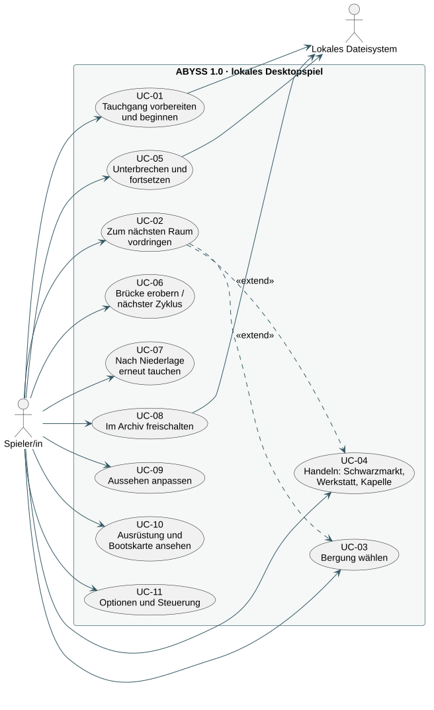
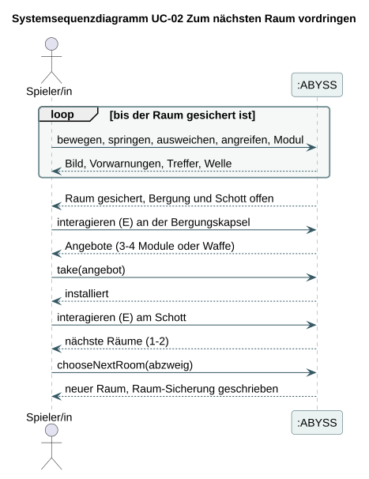
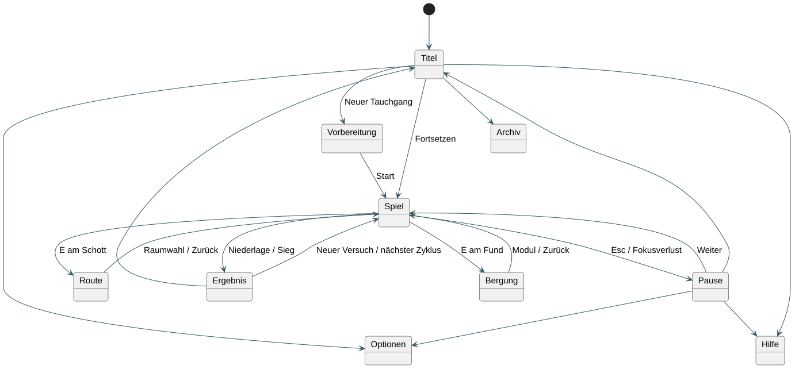
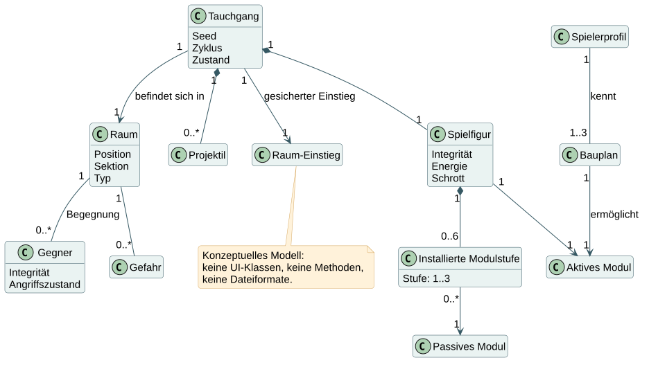
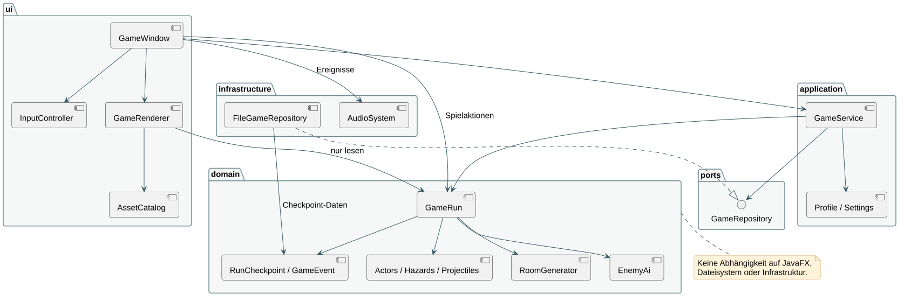
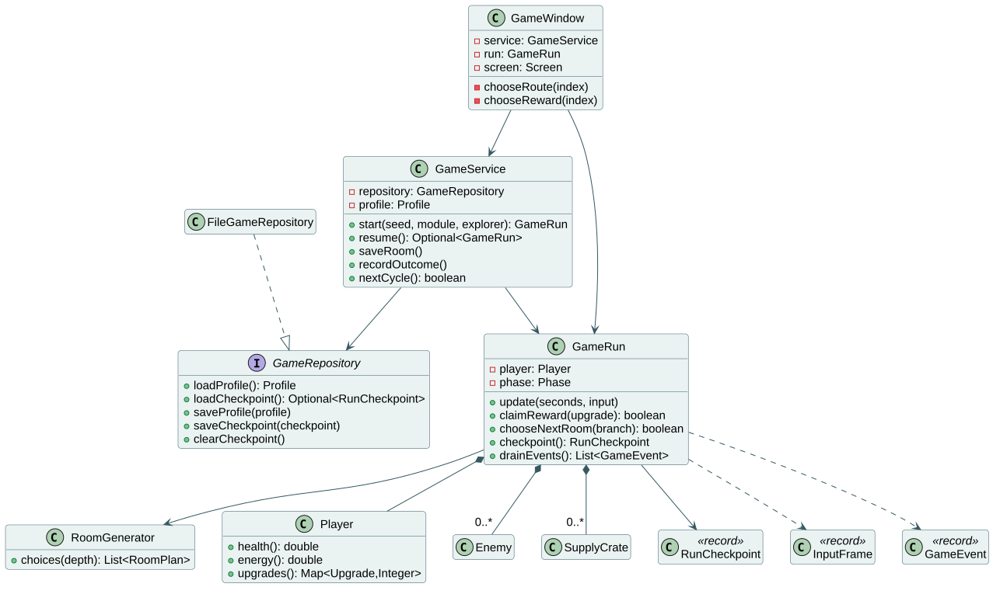
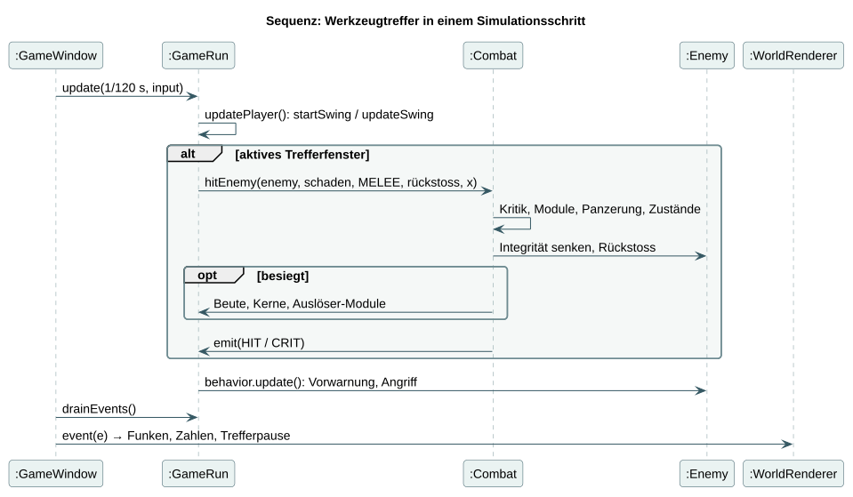

# M2 · Technischer Bericht I – Lösungsarchitektur ABYSS

*Arbeitsfassung nach dem PM3-Auftrag „Lösungsarchitektur (M2)“, Stand 25.09.2026 (Prototyp-Version 1.1). Gliederung gemäss den acht Berichtskapiteln des Auftrags. Die Abgabe erfolgt als PDF in der SoE-Vorlage „Technischer Bericht I“ zusammen mit einer ZIP-Datei aus Quellcode, Konfiguration und Javadoc. Stellen mit `[TEAM]` sind durch das Team zu ergänzen.*

**Abgabeartefakte laut Auftrag und ihr Ort im Repository**

| Artefakt | Ort |
|---|---|
| Vollständiger Quellcode mit Konfiguration | Repository-Wurzel (`src`, `build.gradle`, Gradle Wrapper) |
| API-Dokumentation (HTML) | `./gradlew javadoc` → `build/docs/javadoc/index.html` |
| Technischer Bericht I (PDF) | dieses Dokument als Inhaltsbasis |
| Demonstration | lauffähige App (`./gradlew run` oder Mac-Paket) |

---

## 1 Use-Case-Modell

### 1.1 Übersicht

Abbildung 1 zeigt den Systemkontext: Eine spielende Person ist die einzige Akteurin; das lokale Dateisystem ist Nachbarsystem für Profil und Raum-Sicherung.

*Abbildung 1: Use-Case-Diagramm von ABYSS (PlantUML-Quelle: `docs/diagrams/01-use-cases.puml`).*

*Tabelle 1: Use Cases mit Priorität und Beschreibungstiefe*

| ID | Use Case | Priorität | Tiefe |
|---|---|---|---|
| UC-01 | Tauchgang vorbereiten und beginnen | Muss | casual |
| UC-02 | Zum nächsten Raum vordringen | Muss, Kern | fully dressed |
| UC-03 | Bergung wählen | Muss | casual |
| UC-04 | Handeln: Schwarzmarkt, Werkstatt, Druckkapelle | Muss | casual |
| UC-05 | Unterbrechen und fortsetzen | Muss | casual |
| UC-06 | Brücke erobern / nächster Zyklus | Muss | casual |
| UC-07 | Nach Niederlage erneut tauchen | Muss | brief |
| UC-08 | Im Archiv freischalten | Soll | brief |
| UC-09 | Aussehen anpassen | Soll | brief |
| UC-10 | Ausrüstung und Bootskarte ansehen | Soll | brief |
| UC-11 | Optionen und Steuerung | Muss | brief |

### 1.2 UC-02 „Zum nächsten Raum vordringen“ (fully dressed)

**Ziel:** Alle Wellen eines Raums bewältigen, optional die Belohnung nutzen und einen zulässigen nächsten Raum betreten. **Umfang/Ebene:** ABYSS, Benutzerziel. **Primärakteur:** Spielerin. **Auslöser:** Tauchgang gestartet oder fortgesetzt.

**Stakeholder und Interessen:** Spielende erwarten lesbare Gefahren, reaktionsschnelle Steuerung, faire Belohnungen und sicheren Unterbruch. Das Team braucht nachvollziehbare, testbare Regeln.

**Vorbedingungen:** Gültiger Tauchgang aktiv, Figur lebt, Raum stammt aus einer gültigen Route. **Erfolgsgarantie:** Der gewählte Raum ist aktiv, Build und Ressourcen sind übernommen, der neue Raumeingang ist gesichert. **Minimalgarantie:** Ein ungesicherter Raum kann nicht verlassen werden; Speicherfehler beenden das Spiel nicht.

**Standardszenario**

1. Das System zeigt Raum, Figur, Laufstege, Gegner, Raumtechnik, HUD sowie Name und Sektion des Raums.
2. Die Spielerin bewegt sich, springt, weicht aus und greift mit Waffe und Modul an.
3. Das System kündigt jeden Gegnerangriff an und berechnet Treffer, Kritik, Zustände, Panzerung und Modul-Auslöser.
4. Nach der letzten Welle markiert das System den Raum als gesichert und öffnet das Schott.
5. Die Spielerin öffnet die Bergungskapsel.
6. Das System zeigt drei bis vier Angebote.
7. Die Spielerin wählt ein Angebot; das System installiert es genau einmal.
8. Die Spielerin interagiert mit dem Schott.
9. Das System zeigt ein oder zwei nächste Räume mit Art, Kamerabild, Beschreibung und Bedrohung.
10. Die Spielerin wählt; das System betritt den Raum und sichert den Eingang.

**Erweiterungen:** 2a Pause hält die Simulation an. 2b Unten + Sprung lässt durch einen Laufsteg fallen. 2c An einem Notschalter löst E den Sektionseffekt aus. 2d Eine Anlage trifft einen Wächter und legt seinen Kern frei. 3a Energie fehlt: kein Modul. 3b Integrität null: Niederlage (UC-07) oder Notfallkapsel. 4a Weitere Welle folgt nach Ansage. 4b Hüllenbruch: gesichert nach 40 Sekunden. 6a Alle Module maximiert: weniger Angebote. 7a Angebot vervollständigt eine Resonanz: einmalige Meldung. 9a Nur ein Raum zulässig (Wächter, Werkstatt, Brücke). 10a Speicherfehler: Meldung, Spiel läuft weiter.

**Besondere Anforderungen:** Simulationsschritt 1/120 s; Darstellung und Audio verändern keine Regeln. **Häufigkeit:** bis zu 24-mal pro Zyklus.

Die weiteren Use Cases in casual/brief-Form stehen in [ANFORDERUNGEN.md](../ANFORDERUNGEN.md#weitere-use-cases-casualbrief).

### 1.3 Systemsequenzdiagramm

Abbildung 2 zeigt das SSD für das Standardszenario von UC-02. Die Systemoperationen `update`, `interaction`, `take` und `chooseNextRoom` bilden die Schnittstelle zwischen Spielerin und System.

*Abbildung 2: Systemsequenzdiagramm zu UC-02.*

### 1.4 UI-Skizzen und Navigation

Die Oberfläche ist als „Bordsystem“ gestaltet: Alle Menüs werden im selben Pixelbild wie das Spiel gezeichnet. Abbildung 3 zeigt drei zentrale Bildschirme, Abbildung 4 die Navigation zwischen allen Bildschirmen.

| Vorbereitung (Schleuse) | Bergung | Routenwahl |
|---|---|---|
|  |  |  |

*Abbildung 3: Bildschirmfotos aus dem Prototyp (automatisch erzeugt mit `./gradlew uiSmoke --args="--capture=docs/qa/screens"`).*

*Abbildung 4: Navigationsdiagramm der Bildschirme.*

## 2 Zusätzliche Anforderungen

### 2.1 Weitere Funktionen

*Tabelle 2: Funktionale Anforderungen und ihr Nachweis*

| ID | Anforderung | Nachweis |
|---|---|---|
| F-01 | Bewegung mit Laufstegen, Sprung, Luftsprung, Ausweichen, Kombinationen, Luftangriff | MovementTest, CombatTest |
| F-02 | Zwölf Gegnerarten, fünf Elite-Eigenschaften, vier Bosse mit drei Phasen | CombatTest, CampaignSimulationTest |
| F-03 | 24 Räume in vier Sektionen, Routenwahl, Sonderräume | RoomGeneratorTest |
| F-04 | Sieben Waffen, acht aktive, 41 passive Module, fünf Klassen | CombatTest, RewardTest |
| F-05 | Bergung, Schwarzmarkt, Werkstatt, Versorgung, Kapelle | RewardTest |
| F-06 | Niederlage, Sieg, Zyklus, Druckstufen | GameRunTest, GameServiceTest |
| F-07 | Raum-Sicherung, Profil, Migration | FileGameRepositoryTest |
| F-08 | Meta-Progression, Garderobe, Logbuch | GameServiceTest |
| F-09 | Audio, Pause, Optionen, Vollbild | UI-Prüfung |
| F-10 | Raumzustände mit Regel und Belohnung | RoomGeneratorTest, RoomEventTest |
| F-12 | Resonanzen (Modulpaare) | RewardTest |
| F-13 | Raumtechnik und interaktive Bossarenen | MachineryTest |
| F-15 | Bordsystem-Oberfläche, bedienbar mit Maus und Tastatur | UI-Prüfung |

### 2.2 Qualitätsanforderungen

| ID | Anforderung | Messung / Status |
|---|---|---|
| Q-01 | Testbarkeit: Domäne und Pixel-Pipeline ohne JavaFX testbar | 106 JUnit-Tests ohne Fenster |
| Q-02 | Robustheit: defekte Stände blockieren den Start nicht | Migrations- und Fehlertests |
| Q-03 | Performance: Bild deutlich unter 16 ms | gemessen ≈ 1,9 ms im Mittel |
| Q-04 | Bedienbarkeit: angekündigte Angriffe erkennbar | Nutzertest mit Personen offen |
| Q-05 | Nachvollziehbarkeit: KI, Quellen, Tests dokumentiert | [KI_EINSATZ.md](../KI_EINSATZ.md) |
| Q-06 | Portabilität: Java-Code plattformneutral | nur macOS geprüft |

### 2.3 Randbedingungen

Java als Sprache, JavaFX als Oberflächentechnologie, eigene geschichtete Architektur, keine Frameworks oder Datenbanken, Bibliotheken nur nach Absprache (PM3-Kick-off). Einzige Produktionsbibliothek ist JavaFX; Gradle, JUnit und google-java-format sind Entwicklungswerkzeuge.

### 2.4 Spielregeln (Auszug)

- Ein Raum ist gesichert, wenn alle Wellen besiegt sind (Hüllenbruch: nach 40 Sekunden).
- Jeder Gegnerangriff hat eine sichtbare Vorwarnung; Ausweichen macht kurz unverwundbar.
- Wächter sind ausserhalb ihrer Erholungsphase gepanzert; Anlagen-Treffer durchschlagen die Panzerung.
- Pro Bergung genau eine Wahl; pro Kapelle genau ein Handel; Käufe beim Händler einzeln.
- Eine Niederlage beendet den Tauchgang; Datenkerne, Freischaltungen und Entdeckungen bleiben.

Vollständige Regeln: [ANFORDERUNGEN.md](../ANFORDERUNGEN.md), Werte aller Inhalte: [INHALTE.md](../INHALTE.md).

## 3 Domänenmodell

Abbildung 5 zeigt die fachlichen Konzepte der wichtigsten Use Cases. Ein Tauchgang führt durch ein Boot aus vier Sektionen mit je sechs Räumen. Räume enthalten Wellen von Gegnern, Laufstege, Gefahren, Raumtechnik und Beute und können einen Raumzustand haben. Die Taucherin trägt Waffe, aktives Modul und passive Module; Resonanzen verbinden je zwei Module. Das Profil hält Freischaltungen und Logbuch-Einträge über Tauchgänge hinweg.

*Abbildung 5: Konzeptuelles Domänenmodell (fachliche Begriffe, keine Softwareklassen).*

## 4 Softwarearchitektur

### 4.1 Logische Architektur

Die Anwendung ist in Schichten gegliedert, deren Abhängigkeiten nach innen zeigen (Abbildung 6): Oberfläche → Anwendung → Domäne; die Infrastruktur implementiert den Speicher-Port. Die Domäne importiert weder JavaFX noch Dateisystem-Klassen.

*Abbildung 6: Logische Architektur mit Paketen und Abhängigkeiten.*

| Schicht / Paket | Verantwortung |
|---|---|
| `domain` | Spielregeln: `GameRun` als Aggregat mit Mitarbeitern (`PlayerMotor`, `Arsenal`, `Ballistics`, `Loot`, `Rewards`, `Machinery`), `Combat`, `Physics`, Gegnerstrategien, `RoomGenerator` |
| `application` | `GameService` für Anwendungsfälle; `Profile`, `Loadout`, `Unlock`, `Achievement` |
| `ports` / `infrastructure` | `GameRepository` / `FileGameRepository`, `AudioSystem` |
| `ui.pixel`, `ui.art`, `ui.render` | Software-Framebuffer, prozedurale Pixel-Art, Welt-Renderer |
| `ui.gui`, `ui` | Bordsystem-GUI, Fenster, Spielschleife, Bildschirme, Eingabe |

### 4.2 Architektur-Analyse: die vier wichtigsten Einflussfaktoren

*Tabelle 3: Einflussfaktoren, Lösungen und Belege im Prototyp*

| Einflussfaktor | Lösung | Beleg |
|---|---|---|
| Kursvorgaben: Java, eigene Architektur, keine Frameworks | Eigene Domäne statt Engine; JavaFX nur in `ui`/`infrastructure` | Domänentests ohne JavaFX |
| Reaktionsfähiger 2D-Kampf mit Plattformen | Fester Simulationsschritt 1/120 s, eigene Physik mit einseitigen Laufstegen | MovementTest, Kampagnensimulation |
| Pixel-Art-Look mit dynamischem Licht | Software-Framebuffer 480 × 270, Lichtkarte, Upload als `WritableImage` | Render-Probelauf ≈ 1,9 ms/Bild |
| Wiederspielwert und verlässlicher Unterbruch | Seed-basierter Generator, Meta-Fortschritt, unveränderlicher Checkpoint | Generator-Tests über 600 Seeds, Migrationstests |

### 4.3 Architekturentscheidungen

Die wichtigsten Entscheidungen sind als ADRs in [ARCHITEKTUR.md](../ARCHITEKTUR.md#architekturentscheidungen) dokumentiert: JavaFX mit eigener Domäne (ADR-01), fester Simulationsschritt mit Präsentationseffekten nur in der UI (ADR-02), Checkpoint am Raumeingang (ADR-03), versioniertes Dateiformat mit Migration (ADR-04), Ereignisse für Rückmeldung (ADR-05), Generator mit festen Wächtern (ADR-06), Software-Pixel-Pipeline (ADR-07), prozedurale Pixel-Art (ADR-08), Menüs als Bordsysteme im Framebuffer (ADR-09) und Raumtechnik als Aggregat-Mitarbeiter (ADR-10).

### 4.4 Bibliotheken

| Bibliothek | Zweck | Begründung |
|---|---|---|
| OpenJFX 26 | Fenster, Zeichenfläche, Eingabe, Audio | Kursvorgabe „JavaFX als erste Wahl“ |
| JUnit 6 (nur Test) | Unit-, Integrations- und Systemtests | Standard für Java-Tests |
| google-java-format (nur Build) | einheitliche Formatierung | Coding Conventions ohne manuelle Diskussion |

Die Anwendung ist nicht verteilt; es gibt keine Netzwerkkommunikation.

## 5 Design-Artefakte

### 5.1 Design-Klassendiagramm (Domänenschicht)

*Abbildung 7: Design-Klassendiagramm der Domänenschicht (Auszug, ohne UI-Klassen).*

Abbildung 7 zeigt `GameRun` als einzige öffentliche Änderungsschnittstelle eines Tauchgangs. Mitarbeiterklassen sind paketintern. Gegnerverhalten sind Strategien hinter `EnemyBehavior`; die abstrakte Klasse `Brain` gibt als Schablonenmethode den Ablauf Annähern → Ausholen → Angriff → Erholung vor.

### 5.2 Systemoperationen und Interaktionsdiagramme

*Tabelle 4: Systemoperationen mit Interaktionsdiagramm*

| Systemoperation | Auslöser | Diagramm |
|---|---|---|
| `GameService.start(loadout, seed)` | Tauchgang beginnen (UC-01) | [06-start-sequence](../diagrams/06-start-sequence.svg) |
| `GameRun.update(dt, input)` | jeder Simulationsschritt im Kampf (UC-02) | [07-combat-sequence](../diagrams/07-combat-sequence.svg) |
| `GameRun.take(offer)` | Bergung wählen (UC-03) | [08-reward-sequence](../diagrams/08-reward-sequence.svg) |
| `GameRun.chooseNextRoom(branch)` | nächsten Raum betreten (UC-02) | [09-room-sequence](../diagrams/09-room-sequence.svg) |
| `GameService.resume()` | Tauchgang fortsetzen (UC-05) | [10-resume-sequence](../diagrams/10-resume-sequence.svg) |

*Abbildung 8: Interaktionsdiagramm der Systemoperation `update` während eines Kampfes.*

Das Zustandsdiagramm der Gegner ([11-enemy-state](../diagrams/11-enemy-state.svg)) und die Darstellungs-Pipeline ([13-render-pipeline](../diagrams/13-render-pipeline.svg)) ergänzen die Interaktionsdiagramme.

### 5.3 Designentscheide und Patterns

*Tabelle 5: Angewandte Entwurfsmuster*

| Muster | Umsetzung | Nutzen |
|---|---|---|
| Strategie | `EnemyBehavior` mit 17 Implementierungen | neue Gegner ohne Änderung an `GameRun` |
| Schablonenmethode | `Brain.update` | gemeinsame, testbare Zustandsmaschine |
| Fabrikmethode | `EnemyKind.behavior()` | Zuordnung Art → Verhalten an einer Stelle |
| Beobachter (Pull) | `GameEvent`-Liste für Renderer und Audio | Effekte ohne Rückwirkung auf Regeln |
| Aggregat | `GameRun` | Konsistenz eines Tauchgangs |
| Wertobjekte | Records (`RoomPlan`, `RunCheckpoint`, `StatSheet`, `Profile`) | Unveränderlichkeit, einfache Tests |
| Port/Adapter | `GameRepository` / `FileGameRepository` | Speicher austauschbar |
| Immediate-Mode-GUI | `Gui` | Menüs laufen mit der Spielschleife im Pixelbild |

## 6 Implementation

### 6.1 Verifikation der Architektur durch den Prototyp

Der Prototyp (Version 1.1) implementiert alle Use Cases. Kritische Architekturannahmen werden direkt belegt:

- **Trennung von Regeln und Oberfläche:** Die gesamte Domäne läuft in Tests ohne JavaFX. Ein automatischer Testspieler (`qa/CampaignPilot`) spielt vollständige Tauchgänge nur über öffentliche Aktionen.
- **Echtzeit-Darstellung in Java:** Der Render-Probelauf zeichnet 60 Sekunden lang jedes Bild vollständig; gemessen wurden ≈ 1,9 ms pro Bild ohne Fehler ([render-soak.json](../qa/render-soak.json)).
- **Robuster Unterbruch:** Raum-Sicherungen und Profile werden versioniert gespeichert; alte Formate werden migriert.

### 6.2 Teststrategie

*Tabelle 6: Teststufen*

| Stufe | Inhalt | Werkzeug |
|---|---|---|
| Unit | Domänenregeln: Bewegung, Kampf, Belohnungen, Generator, Raumtechnik, Raumereignisse | JUnit (`src/test`) |
| Integration | Anwendungsdienst mit Speicher; Dateiformat mit Migration | JUnit (`GameServiceTest`, `FileGameRepositoryTest`) |
| System (automatisiert) | vollständige Tauchgänge durch den Testspieler, alle Klassen | `CampaignSimulationTest`, `./gradlew balance` |
| Oberfläche | echtes JavaFX-Fenster, 37 Schritte durch alle Bildschirme | `./gradlew uiSmoke` |
| Darstellung | Render-Probelauf, Übersichtsbögen, Szenenbilder | `renderSoak`, `artSheet`, `sceneShot` |

Details und Ergebnisse: [TESTSTRATEGIE.md](../TESTSTRATEGIE.md).

## 7 Projektmanagement

### 7.1 Bisherige Iterationen

*Tabelle 7: Iterationen bis zum aktuellen Stand*

| Iteration | Ziel | Ergebnis | Soll/Ist-Aufwand |
|---|---|---|---|
| Konzept (18.–21.09.) | Idee, Konzept v2, Präsentation SWEN1 | Konzeptdemo, Folien | `[TEAM]` |
| Prototyp 0.1/0.2 (22.09.) | spielbarer Durchlauf | 18 Räume, drei Bosse (KI-unterstützt) | `[TEAM]` |
| Version 1.0 (25.09., nachts) | Pixel-Art, Inhalt, Tests | 24 Räume, vier Bosse, 95 Tests | `[TEAM]` |
| Version 1.1 (25.09.) | Bordsystem-GUI, Raumtechnik | 106 Tests, interaktive Bossarenen | `[TEAM]` |

Die Prototyp-Versionen entstanden überwiegend in autonomen KI-Sitzungen (siehe [KI_EINSATZ.md](../KI_EINSATZ.md)). Tatsächliche Personenstunden des Teams sind nicht erfasst und müssen vom Team nachgetragen werden.

### 7.2 Massnahmen und nächste Planung

1. **Verstehen und verteilen:** Jedes Teammitglied übernimmt ein Paket und erklärt dessen Klassen (Code-Walkthrough).
2. **Nutzertest:** drei bis fünf Personen spielen die ersten zehn Minuten; Beobachtungen priorisieren.
3. **Spielgefühl und Balancing** anhand der Beobachtungen anpassen.
4. **Zielplattformen:** Build und Test auf allen Teamrechnern.

### 7.3 Aktuelle Risiken

Siehe [PROJEKTMANAGEMENT.md](../PROJEKTMANAGEMENT.md#risikoliste). Höchstes Risiko: Das Team muss den umfangreichen Code verstehen und selbst begründen können.

## 8 Glossar

Die wichtigsten Begriffe (Tauchgang, Zyklus, Druckstufe, Sektion, Raumzustand, Raumtechnik, Notschalter, Resonanz, Bergung, Datenkern …) sind in [GLOSSAR.md](../GLOSSAR.md) definiert und werden laufend gepflegt.

---

## Abbildungsverzeichnis

1. Use-Case-Diagramm · 2. Systemsequenzdiagramm UC-02 · 3. Bildschirmfotos · 4. Navigationsdiagramm · 5. Domänenmodell · 6. Logische Architektur · 7. Design-Klassendiagramm · 8. Kampfsequenz

## Tabellenverzeichnis

1. Use Cases · 2. Funktionale Anforderungen · 3. Einflussfaktoren · 4. Systemoperationen · 5. Entwurfsmuster · 6. Teststufen · 7. Iterationen
