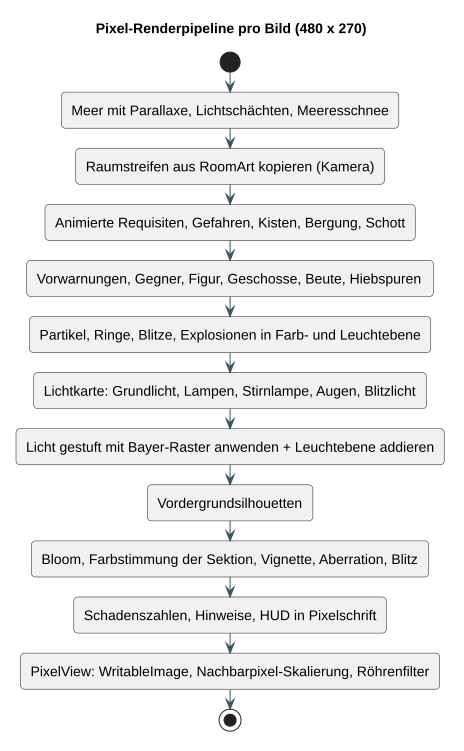

# M3 · Technischer Bericht II – Prototyp ABYSS

*Arbeitsfassung nach dem PM3-Auftrag „Prototyp und technischer Bericht II (M3)“, Stand 25.09.2026 (Prototyp-Version 1.1). Der Bericht erweitert [Technischer Bericht I](../m2-loesungsarchitektur/TECHNISCHER_BERICHT_I.md) und wird für die Abgabe in die SoE-Vorlage „Technischer Bericht II“ übertragen (ca. 30 Seiten, Abstract auf eigener Seite nach dem Deckblatt). Feedback aus M2 ist nach der Demonstration einzuarbeiten (`[TEAM]`).*

---

## Abstract

Short, replayable play sessions with understandable decisions are widely expected by players, yet games that use a single vehicle as their world usually focus on steering it rather than on the journey through it. This project, ABYSS, investigates whether a two-dimensional action roguelite set inside one very long submarine can deliver varied, fair runs within a university software project built with Java and JavaFX and without game frameworks. The player starts in the stern and fights room by room through four sections to the bridge, choosing between risky and safe routes, collecting modules and facing a guardian at the end of each section. The approach combined a layered architecture with a framework-free domain model, a fixed simulation step, a seed-based room generator and a software renderer that draws the world, the interface and all artwork procedurally into a low-resolution frame buffer. Quality was assessed with 106 automated unit and integration tests, a bot that plays complete runs through the public game interface, an automated check of all user-interface screens in a real window and render measurements. The resulting prototype provides 24 rooms in 33 themed departments, twelve enemy types, four guardians in interactive arenas, room machinery such as presses and lasers, seven weapons, 41 modules and persistent progression; a frame is drawn in about two milliseconds and the bot completes runs with all five character classes. Whether the game feels fair and motivating to human players has not yet been tested. Further work comprises user tests, platform tests on Windows and Linux and an evaluation of the balancing with real play data.

---

## 1 Projektidee

ABYSS ist ein 2D-Action-Roguelite im Inneren eines langen U-Boots. Die Spielfigur beginnt im Heck und kämpft sich durch 24 Räume in vier Sektionen bis zur Brücke. Abzweigungen erlauben die Wahl zwischen Risiko und Sicherheit, Module verändern den Build, am Ende jeder Sektion wartet ein Wächter. Niederlagen beenden den Tauchgang; Datenkerne, Freischaltungen und Entdeckungen bleiben. Zielgruppe sind Spielende mit kurzen Pausen von etwa 20 bis 30 Minuten (Persona „Lina“, Annahme). Die vollständige Idee mit Kundennutzen, Konkurrenzanalyse und Kontextszenario steht in der [Projektskizze](../m1-projektskizze/PROJEKTSKIZZE.md).

## 2 Analyse

- **Use Cases:** Übersicht, UC-02 fully dressed, weitere casual/brief und das Systemsequenzdiagramm stehen in [TB I, Kapitel 1](../m2-loesungsarchitektur/TECHNISCHER_BERICHT_I.md#1-use-case-modell) und [ANFORDERUNGEN.md](../ANFORDERUNGEN.md).
- **Zusätzliche Anforderungen:** funktionale Anforderungen F-01 bis F-15, Qualitätsanforderungen Q-01 bis Q-06, Randbedingungen und Spielregeln in [TB I, Kapitel 2](../m2-loesungsarchitektur/TECHNISCHER_BERICHT_I.md#2-zusätzliche-anforderungen).
- **Domänenmodell:** Abbildung 1.

*Abbildung 1: Konzeptuelles Domänenmodell.*

Gegenüber M2 kamen fachlich hinzu: Raumtechnik (Förderband, Dampfdüse, Turbinenwind, Presse, Lasergitter, Notschalter), die Raumzustände Hüllenbruch und Schlagseite, Schmugglerdrohnen und Resonanzen. `[TEAM: M2-Feedback eintragen]`

## 3 Design

### 3.1 Architektur

Die geschichtete Architektur mit nach innen gerichteten Abhängigkeiten ist in [TB I, Kapitel 4](../m2-loesungsarchitektur/TECHNISCHER_BERICHT_I.md#4-softwarearchitektur) begründet (Abbildung 2).

*Abbildung 2: Logische Architektur.*

### 3.2 Design-Klassendiagramm und Interaktionsdiagramme

Das DCD der Domänenschicht ([04-design-classes](../diagrams/04-design-classes.svg)) zeigt `GameRun` als Aggregat mit den paketinternen Mitarbeitern `PlayerMotor`, `Arsenal`, `Ballistics`, `Loot`, `Rewards` und `Machinery`. Fünf Systemoperationen sind mit Interaktionsdiagrammen belegt: `start`, `update`, `take`, `chooseNextRoom`, `resume` (siehe [TB I, Tabelle 4](../m2-loesungsarchitektur/TECHNISCHER_BERICHT_I.md#52-systemoperationen-und-interaktionsdiagramme)).

*Abbildung 3: Darstellungs-Pipeline vom Domänenzustand bis zum Bild auf der JavaFX-Zeichenfläche.*

### 3.3 Weitere Designentscheide seit M2

| Entscheid | Begründung | Folge |
|---|---|---|
| Menüs als Bordsysteme im Framebuffer (ADR-09) | JavaFX-Controls wirkten als Fremdkörper im Pixel-Look | eigenes Immediate-Mode-GUI `ui.gui.Gui`; keine Schriftdateien mehr |
| Raumtechnik als Aggregat-Mitarbeiter (ADR-10) | interaktive Räume ohne Eingriff in Gegner- und Bosslogik | `Fixture` (Takt) und `Machinery` (Wirkung); Quelle `MACHINE` durchschlägt Bosspanzerung |
| Eigene Zufallsströme für Raumzustände und Technik | neue Inhalte sollen bestehende Seeds nicht verschieben | reproduzierbare Räume, stabile Tests |
| Hüllenbruch als Zeitziel statt Wellenzahl | Abwechslung in der Raumaufgabe | eigene Wellenlogik in `GameRun.updateBreach` |

Alle Architekturentscheidungen (ADR-01 bis ADR-10) und Muster: [ARCHITEKTUR.md](../ARCHITEKTUR.md).

## 4 Implementation

### 4.1 Lieferergebnisse und Paketierung

| Ergebnis | Erzeugung | Inhalt |
|---|---|---|
| Quellcode-ZIP | Release auf GitHub bzw. `Pakete/` | Quellcode, Gradle-Konfiguration, Javadoc, Testresultate |
| API-Dokumentation | `./gradlew javadoc` | Javadoc aller öffentlichen Klassen und Methoden |
| Mac-App (Apple Silicon) | `python3 tools/package_mac.py` | eigenständiges App-Bundle mit Java-Laufzeit |
| Gameplay-Demo | `./gradlew renderDemo` | ca. 90 Sekunden aus dem echten Renderer |

Umfang des Prototyps: 95 Java-Dateien im Hauptcode (≈ 23 000 Zeilen), 13 Testklassen und 8 QA-Werkzeuge. Die Inhalte sind in [INHALTE.md](../INHALTE.md) automatisch aus dem Code erzeugt.

### 4.2 Teststrategie und Übersicht

*Tabelle 1: Tests nach Stufe*

| Stufe | Testklassen | Umfang |
|---|---|---|
| Unit | `GameRunTest`, `MovementTest`, `CombatTest`, `RewardTest`, `RoomGeneratorTest`, `MachineryTest`, `RoomEventTest`, `InputControllerTest`, `FrameTest` | Regeln der Domäne, Pixelgrundlagen, Eingabe |
| Integration | `GameServiceTest`, `FileGameRepositoryTest`, `RenderSmokeTest` | Anwendungsdienst mit Speicher, Dateiformat, Renderer über alle Sektionen |
| System | `CampaignSimulationTest`, Balancebericht | vollständige Tauchgänge aller Klassen, 30 Seeds je Klasse |
| Oberfläche | `uiSmoke` | 37 Schritte in einem echten JavaFX-Fenster |

*Tabelle 2: Ergebnisse vom 25.09.2026*

| Prüfung | Ergebnis |
|---|---|
| JUnit | 106 Tests bestanden, auch im frisch entpackten Quellpaket |
| Formatprüfung und Javadoc | bestanden, ohne Warnungen |
| UI-Prüfung | 37/37 |
| Render-Probelauf (60 s) | 0 Fehler, ≈ 1,9 ms pro Bild |
| Balancebericht (30 Seeds je Klasse) | vier Klassen 30/30 Siege, Koloss 26/30, keine Hänger |

Grenzen: Der Testspieler reagiert fehlerfrei; seine Siegquoten sind obere Grenzen. Klänge wurden nur geladen, nicht angehört. Nur macOS wurde geprüft. Details: [TESTSTRATEGIE.md](../TESTSTRATEGIE.md), Protokolle: [docs/qa](../qa/).

## 5 Resultate

### 5.1 Erreichte Ziele gegenüber der ursprünglichen Idee

*Tabelle 3: Konzept v2 (21.09.2026) und Prototyp 1.1*

| Bestandteil | Konzept v2 | Prototyp 1.1 |
|---|---|---|
| Welt | drei Sektionen, zwölf Räume | vier Sektionen, 24 Räume, 33 Abteilungen |
| Gegner | drei Grundtypen und ein Brückenboss | zwölf Arten, Schmugglerdrohne, vier Wächter mit drei Phasen |
| Ausrüstung | sechs Module | sieben Waffen, acht aktive und 41 passive Module, neun Resonanzen |
| Fortschritt | Baupläne | Archiv, Garderobe, Logbuch mit 26 Zielen, Druckstufen, Zyklen |
| Raumgestaltung | Kampf, Gefahr, Werkstatt, Beute | zusätzlich Raumzustände und interaktive Raumtechnik |
| Grafik | Konzeptbilder | prozedurale Pixel-Art mit Licht, Menüs im selben Stil |

### 5.2 Offene Punkte

- Nutzertests mit Personen aus der Zielgruppe (Q-04) stehen aus.
- Spielgefühl, Schwierigkeit und Klanggestaltung sind nicht von Menschen bewertet.
- Windows und Linux sind nicht geprüft; Gamepad und frei belegbare Tasten fehlen.
- Personenstunden und Iterationsaufwände des Teams sind nachzutragen.

### 5.3 Weiterentwicklung

Nutzertests mit Laufprotokoll zur Balancierung, Waffen-Evolutionen, Story-Fragmente mit alternativen Enden, weitere Sektionen und Bosse sowie Builds für weitere Plattformen.

---

## Anhang

### A · Quellen

Die Quellen der Konkurrenzanalyse stehen in der [Projektskizze](../m1-projektskizze/PROJEKTSKIZZE.md#quellen). Verwendete Bibliotheken und Werkzeuge: [CREDITS.md](../CREDITS.md). Kursquellen: PM3-Aufträge M1–M3, Kick-off und „Verwendung von KI im PM3“ (lokale Moodle-Exporte vom 14./15.09.2026, nicht im Repository enthalten).

### B · Dokumentation der KI-Verwendung

Gemäss Kursvorgabe mit den Spalten KI, Ziel, Prompt-Aufwand, Resultat verwendet und Art der Verwendung: [KI_EINSATZ.md](../KI_EINSATZ.md). Der Code der Versionen 1.0 und 1.1 wurde weitgehend mit Anthropic Claude erstellt; Versionen 0.1/0.2 mit OpenAI Codex.

### C · Glossar, Anleitungen, Testresultate

- Glossar: [GLOSSAR.md](../GLOSSAR.md)
- Spielanleitung und Überblick: [MORGEN.md](../MORGEN.md), [README](../../README.md)
- Testresultate: [qa/test-summary.json](../qa/test-summary.json), [qa/ui-smoke.txt](../qa/ui-smoke.txt), [qa/render-soak.json](../qa/render-soak.json)
- Projektmanagement: [PROJEKTMANAGEMENT.md](../PROJEKTMANAGEMENT.md), Arbeitsjournal: [WORK_PLAN.md](../WORK_PLAN.md)

### D · Abbildungs- und Tabellenverzeichnis

Abbildungen: 1 Domänenmodell · 2 Logische Architektur · 3 Darstellungs-Pipeline. Tabellen: 1 Tests nach Stufe · 2 Ergebnisse · 3 Konzept und Prototyp.
